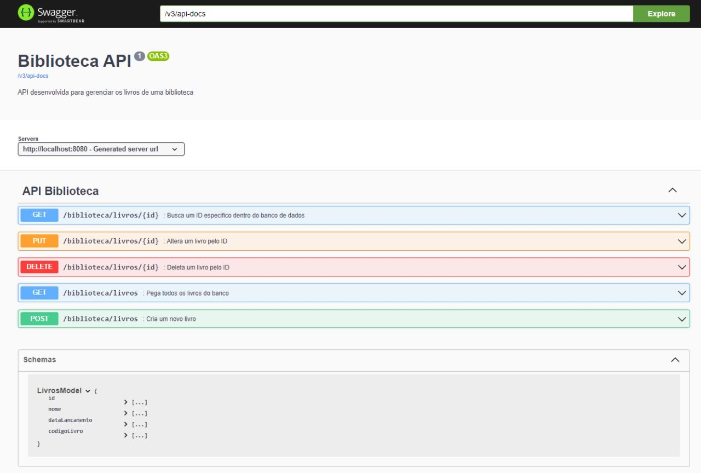

# :books: API Biblioteca # :books:

---

### 🔷 Resumo

<p>Desenvolver uma API para uma biblioteca:
</p>

- Exibir todos os livros.
- Exibir um livro específico.
- Cadastro de um novo livro.
- Alteração de um livro.
- Deleção de um livro.

<p>Atributos:
</p>

- Nome.
- Autor.
- Data de lançamento.
- Código do livro.
---

## ⏯️ Como executar os Programas

- Você precisará ter o [JDK 17](https://www.oracle.com/java/technologies/downloads/#java17) instalado no seu computador;
- Baixe o repositório do projeto (com todos os algoritmos);
- Abra o terminal e navegue até o o arquivo ApiBibliotecaApplication presente na pasta de exercício que você deseja executar;
- Compile o arquivo executando o comando `javac`, como mostra abaixo o exemplo executando o [Main](https://github.com/guiijanuario/StarWars-ExerciseModulo4/blob/main/src/main/java/org/example/exerciseModule4/Main.java) :
```
javac Main.java
```
- Após compilar, execute o comando `java`, como mostra abaixo:
```
java Main.java
```


### 🐳 Como executar o docker

- Necessário ter docker instalado em sua máquina.
- Você precisará ter o [Docker](https://www.docker.com/products/docker-desktop/) instalado no seu computador;
- Abra o terminal e navegue até o o arquivo src/main/resources presente na pasta do projeto que você deseja executar;
- Execute o docker compose executando o comando `docker-compose up`, como mostra abaixo o exemplo executando o [Main](https://github.com/joaocruzzup/Exercicio-Exceptions/blob/main/src/main/java/org/example/exercicio01/Main.java) :
- Criar um banco de dados com o nome apibiblioteca;

```
docker-compose up
```

### 🗂️ Documentação com Swagger

- Após rodar o projeto acessar o link: [Link Swagger](http://localhost:8080/swagger-ui/index.html#/)



---

## 👨‍💻 Autor

Nome: Guilherme Januário <br>Linkedin: https://www.linkedin.com/in/guilherme-janu%C3%A1rio/

---

<h4 align=center>©️ Made with 💚 by <a href="https://github.com/guiijanuario">Guilherme Januário</a></h4>
